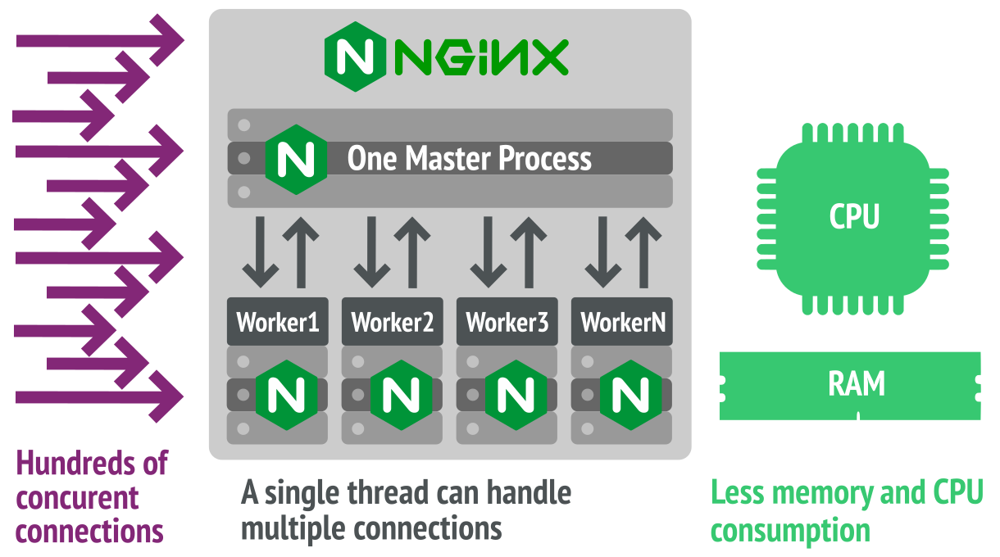
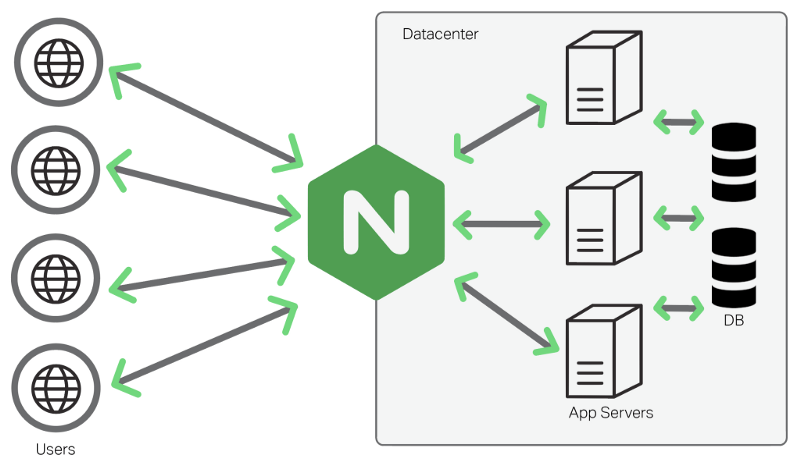
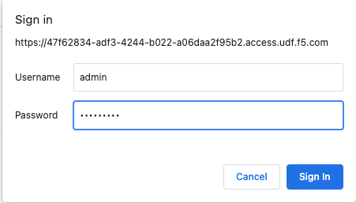
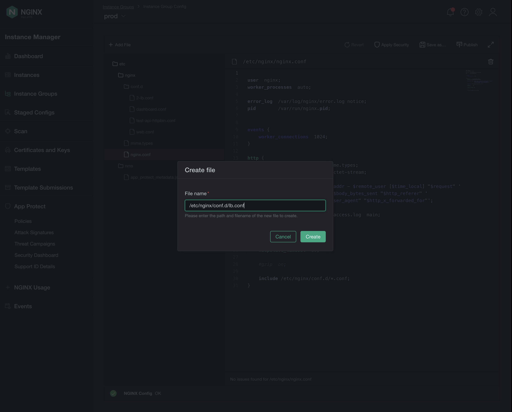

# (Install NGINX Plus) SKIP - DONE Already!!!
	
	sudo mkdir -p /etc/ssl/nginx
 	sudo cp <downloaded-file-name>.crt /etc/ssl/nginx/nginx-repo.crt
	sudo cp <downloaded-file-name>.key /etc/ssl/nginx/nginx-repo.key
 	sudo apt update && \
	sudo apt install apt-transport-https \
                 lsb-release \
                 ca-certificates \
                 wget \
                 gnupg2 \
                 ubuntu-keyring
 	wget -qO - https://cs.nginx.com/static/keys/nginx_signing.key \
    	| gpg --dearmor \
    	| sudo tee /usr/share/keyrings/nginx-archive-keyring.gpg >/dev/null
 		
   	#Add the NGINX Plus repository
  	printf "deb [signed-by=/usr/share/keyrings/nginx-archive-keyring.gpg] \
	https://pkgs.nginx.com/plus/ubuntu `lsb_release -cs` nginx-plus\n" \
	| sudo tee /etc/apt/sources.list.d/nginx-plus.list

  	#Download the nginx-plus apt configuration to /etc/apt/apt.conf.d
   	sudo wget -P /etc/apt/apt.conf.d https://cs.nginx.com/static/files/90pkgs-nginx
	#Update the repository information
 	sudo apt update
  	#Install the nginx-plus package
   	sudo apt install -y nginx-plus
	#Check installed version
 	nginx -v
	
# LAB-1: Explore - Review NGINX Plus Default Configuration
## UDF > Components > Nginx-plus-apigw > Access > Web Shell

### Exploration Commands ###

	# Check running processes status
 	ps aux | grep nginx

  	# Check NGINX Deployment
 	cd /etc/nginx/
 	cat nginx.conf
	cd conf.d/
	cat default.conf
	sudo mv default.conf default.conf.bak #ignore if not present
	sudo nginx -t
	sudo nginx -T
	sudo nginx -v
	sudo nginx -V
	sudo nginx -s reload

# LAB-2: Web Server Configuration

## UDF > Components > Nginx-plus-apigw > Access > Web Shell	
### Create/Copy files to be served by NGINX Web Server ###
	cd /opt/services/
	cd App1/
	ls
	cat index.html
	cd /etc/nginx/conf.d/
	sudo vi web.conf

 	cd /opt/services/
	cd App2/
	ls
	cat index.html
	cd /etc/nginx/conf.d/
	sudo vi web.conf

	cd /opt/services/
	cd App3/
	ls
	cat index.html
	cd /etc/nginx/conf.d/
	sudo vi web.conf
 
### web.conf ###
server {
    
    listen       9001;
    index  index.html;
   
    location / {
    root   /opt/services/App1;
    }
}

server {
    
    listen       9002;
    index  index.html;

    location / {
    root   /opt/services/App2;
    }
}

server {
    
    listen       9003;
    index  index.html;

    location / {
    root   /opt/services/App3;
    }
}
### ###

	sudo nginx -t
	sudo nginx -s reload
	curl 10.1.1.11:9001
	curl 10.1.1.11:9002
	curl 10.1.1.11:9003

# LAB-3: Configuring Load Balancer

## UDF > Components > NIM > ACCESS > NIM UI
### Let's use NGINX Instance Manager (NIM) for this part!
NIM is the awesome NGINX Central Management tool, you can find details here:
[**NIM**](https://docs.nginx.com/nginx-instance-manager/)

### Acces the NIM UI and find your NGINX instances ###

To sign in use the username "admin" and password "find-in-UDF"

Discover the instances in NGINX Instance Manager.

After you are done with exploring the intuitive NIM UI, create the lb.conf in the directory /etc/nginx/conf.d/ :

NIM UI > Instance Groups > Click "Add File" and Enter the file path and name: lb.conf 

	

	### lb.conf ###
	upstream backend_servers {
    zone backend_server_zone 64k;
    server 127.0.0.1:9001;
    server 127.0.0.1:9002;
	}

	server {
    listen 9000;
    autoindex on;

    location / {
    proxy_pass http://backend_servers/;
    #health_check;

    proxy_set_header Host $host;
    proxy_set_header X-Forwarded-For $proxy_add_x_forwarded_for;
    proxy_set_header X-Real-IP  $remote_addr;
    proxy_set_header Upgrade $http_upgrade;
    proxy_set_header Connection "upgrade";

    }
}

### Test Load Balancer ###

	sudo nginx -t
	sudo nginx -s reload
	curl localhost:9000
	curl localhost:9000
	curl localhost:9000

# LAB-4: Configuring NGINX Plus Dashboard

### dashboard.conf ###

server {

    listen       8080;

        location /api {
        api write=on;
        allow all;
    }

    location / {
    root /usr/share/nginx/html;
    index   dashboard.html;
    }
}

### ###

# LAB-5: Configuring NGINX Plus as an API Gateway
On "docker_api" Box

	cd /opt/ergast-f1-api/
	sudo ./start.sh --build
	sudo docker ps
	curl localhost:8001/api/f1/drivers

On "ubuntu_plus" Box

	cd /etc/nginx/conf.d/
	sudo vi api_gateway.conf

### api_gateway ###

#limit_req_zone $remote_addr zone=perip:1m rate=2r/s;

upstream f1-api {
        server 10.1.1.7:8001; #validate IP address of docker_api
        server 10.1.1.7:8002;

}

server {

        listen 9443;
        #listen 9443 ssl;
        #ssl_certificate ssl/www.example.com.crt; 
        #ssl_certificate_key ssl/www.example.com.key; 
        #ssl_protocols TLSv1.3 TLSv1.2 TLSv1.1; 
        #ssl_prefer_server_ciphers on; 

        location /api/f1/drivers {
        proxy_pass http://f1-api;

        #limit_req zone=perip nodelay;
        #limit_req_status 429;                 

        }

        location /api/f1/seasons {
        proxy_pass http://f1-api;
        }

        location /api/f1/circuits {
        proxy_pass http://f1-api;
        }
}

### ###

	sudo nginx -t
	sudo nginx -s reload
	curl localhost:9443/api/f1/drivers
	curl localhost:9443/api/f1/seasons

API Gateway - SSL Termination

	cd /etc/nginx/
	sudo mkdir ssl
	cd ssl/
	sudo cp /opt/ssl/www.example.com* .
	ls
	cd conf.d/
	sudo vim api_gateway.conf
	sudo nginx -t
	sudo nginx -s reload
	curl localhost:9443/api/f1/drivers
	curl https://localhost:9443/api/f1/drivers --insecure

Enable Rate Limiting

	cd /etc/nginx/conf.d/
	sudo vi api_gateway.conf
	sudo nginx -t
	sudo nginx -s reload
	curl https://localhost:9443/api/f1/drivers --insecure
	!!;!!;!!;!!;!!;

# OPTIONAL LAB-6: Configuring NGINX App Protect (WAF)
Install & Configure APP Protect

"Install NAP"
	cd /opt/install-nginx/
	sudo cp -a /etc/nginx /etc/nginx-plus-backup
	sudo apt-get install apt-transport-https lsb-release ca-certificates wget
	sudo wget https://cs.nginx.com/static/keys/nginx_signing.key && sudo apt-key add nginx_signing.key
	printf "deb https://plus-pkgs.nginx.com/ubuntu `lsb_release -cs` nginx-plus\n" | sudo tee /etc/apt/sources.list.d/nginx-plus.list
	sudo apt-get update
	sudo apt-get install app-protect
	cd /etc/nginx/
	sudo vi nginx.conf
	# insert
	# load_module modules/ngx_http_app_protect_module.so;
	sudo service nginx stop
	sudo service nginx start

"Configure NAP"

	cd /etc/nginx/conf.d/
	sudo vi nap_dvwa.conf

### nap_dvwa.conf ###

    upstream app_backend_dvwa {
        zone nap_protected_app 128k;
        server   10.1.1.7:9091;
    }

    server {
        listen 80 default_server;
        proxy_http_version 1.1;

        app_protect_enable off;
        app_protect_policy_file "/etc/nginx/NginxDefaultPolicy.json";
        app_protect_security_log_enable on;
        #app_protect_security_log "/etc/nginx/logprofiles/log-default.json" syslog:server=10.200.1.1:5144;
        app_protect_security_log "/opt/app_protect/share/defaults/log_default.json" /var/log/app_protect/security.log;

        location / {
            default_type text/html;
            proxy_pass http://app_backend_dvwa;
            proxy_set_header Host $host;
        }

        location /vulnerabilities/exec/ {

            app_protect_enable off;
            app_protect_policy_file "/etc/nginx/NginxDefaultPolicy.json";
            app_protect_security_log_enable on;
            #app_protect_security_log "/etc/nginx/logprofiles/log-default.json" syslog:server=10.200.1.1:5144;
            app_protect_security_log "/opt/app_protect/share/defaults/log_default.json" /var/log/app_protect/security.log;

            default_type text/html;
            proxy_pass http://app_backend_dvwa;
            proxy_set_header Host $host;
        }

        location /vulnerabilities/sqli/ {
            app_protect_enable off;
            app_protect_policy_file "/etc/nginx/dvwa-policy-v1.json";
            app_protect_security_log_enable on;
            #app_protect_security_log "/etc/nginx/logprofiles/log-custom.json" syslog:server=10.200.1.1:5144;
            app_protect_security_log "/opt/app_protect/share/defaults/log_default.json" /var/log/app_protect/security.log;

            default_type text/html;
            proxy_pass http://app_backend_dvwa;
            proxy_set_header Host $host;
        }
    }

### ###

Username / Password for DVWA Website: admin / password
Command Injection: 127.0.0.1
Command Injection: 127.0.0.1; cat /etc/passwd

sudo cp /opt/dvwa-policy-v1.json /etc/nginx/

SQL Injection: 2
SQL Injection: %' and 1=0 union select null, concat(user,':',password) from users #

Install K8s

	sudo su
	apt-get update
	curl -s https://raw.githubusercontent.com/jay-nginx/basic-workshop-udf/main/install-K8s.sh | bash
	kubectl version
	kubectl get pods

Install HELM

	cd /opt/
	git clone https://github.com/nginxinc/kubernetes-ingress/
	cd kubernetes-ingress/deployments/helm-chart
	git checkout v1.9.1
	curl https://baltocdn.com/helm/signing.asc | sudo apt-key add -
	sudo apt-get install apt-transport-https --yes
	echo "deb https://baltocdn.com/helm/stable/debian/ all main" | sudo tee /etc/apt/sources.list.d/helm-stable-debian.list
	sudo apt-get update
	sudo apt-get install helm
	helm repo add nginx-stable https://helm.nginx.com/stable
	helm repo update

Make NGINX Plus Container

	cd /opt/kubernetes-ingress/
	sudo cp /opt/nplus-keys/nginx-repo* .
	apt install make
	make DOCKERFILE=DockerfileForPlus PREFIX=nginx-plus-ingress
	Note: Ignore the errors received for pushing the image to a repo
	docker images
	helm install my-release nginx-stable/nginx-ingress --set controller.image.repository=nginx-plus-ingress --set controller.nginxplus=true

Install a Demo Application

	cd /opt/kubernetes-ingress/examples/complete-example
	ls
	cat cafe.yaml
	cat cafe-secret.yaml
	cat cafe-ingress.yaml
	sudo vi cafe-ingress.yaml ( edit to include the ingressClassName )
	kubectl apply -f cafe.yaml
	kubectl apply -f cafe-secret.yaml
	sudo vi cafe-ingress.yaml
	kubectl apply -f cafe-ingress.yaml
	kubectl get svc
	curl -H "Host: cafe.example.com" https://10.1.1.4:32691/tea --insecure
 
 #Review NGINX Ingress Controller Default Configuration
 
