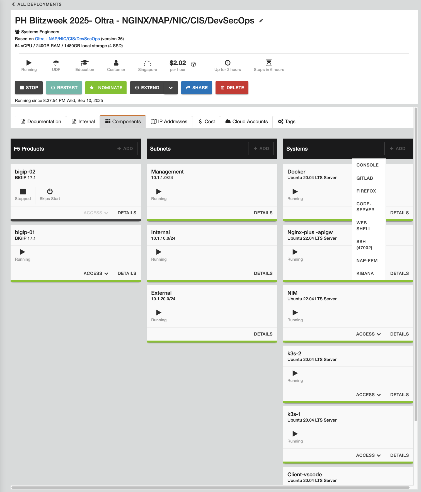
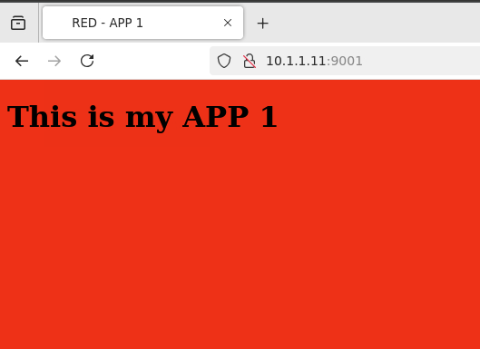
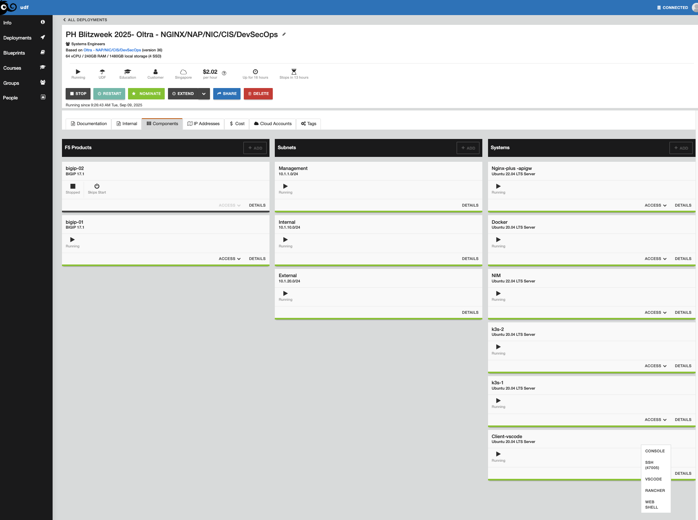
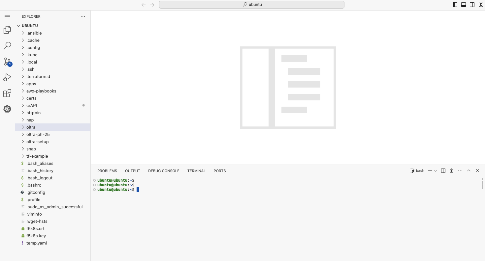

## The History and Architecture of NGINX

NGINX | NGINX
:-------------------------:|:-------------------------:
|

NGINX was written in 2002 by Igor Sysov while he was working at rambler.ru, a web company providing Internet Search content.  As Rambler continued to grow, Igor kept hitting the practical limit of 10,000 simultaneous HTTP requests with Apache HTTP server.  The only way to handle more traffic was to buy and run more servers.  So he wrote NGINX to solve the `C10k concurrency problem` - how do you handle more than 10,000 concurrent requests on a single Linux server.  

Igor created a new TCP connection and request handling concept called the `NGINX Worker`.  The Workers are Linux processes that continually wait for incoming TCP connections, and immediately handle the Request, and deliver the Response.  It is based on event-driven computer program logic written in the `native C programming language`, which is well-known for its speed and power.  Importantly, NGINX Workers can use any CPU, and can scale in performance as the compute hardware scales up, providing a nearly linear performance curve.  There are many articles written and available about this NGINX Worker architecture if you are interested in reading more about it.  

Another architecural concept in NGINX worth noting, is the `NGINX Master` process.  The master process interacts with the Linux OS, controls the Workers, reads and validates config files before using them, writes to error and logging files, and performs other NGINX and Linux management tasks.  It is considered the Control plane process, while the Workers are considered the Data plane processes.  The `separation of Control functions from Data handling functions` is also very beneficial to handling high concurrency, high volume web traffic.

NGINX also uses a `Shared Memory model`, where common elements are equally accessed by all Workers.  This reduces the overall memory footprint considerably, making NGINX very lightweight, and ideal for containers and other small compute environments.  You can literally run NGINX off a legacy floppy disk!

In the `NGINX Architectural` diagram below, you can see these different core components of NGINX, and how they relate to each other.  You will notice that Control and Management type functions are separate and independent from the Data flow functions of the Workers that are handling the traffic.  You will find links to NGINX core architectures and concepts in the References section.

>> It is this unique architecture that makes NGINX so powerful and efficient.


- In 2004, NGINX was released as open source software (OSS).  It rapidly gained popularity and has been adopted by millions of websites.

- In 2013, NGINX Plus was released, providing additional features and Commercial Support for Enterprise customers.

<br/>

## So what is NGINX Plus?  

NGINX Plus 
:-------------------------:


NGINX Plus is the `Commercial version of NGINX`, with additional Enterprise features on top of the base NGINX Opensource OSS build. Here is a Summary list of the Plus features:

- Dynamic reconfiguration reloads with no downtime
- Dynamic NGINX software updates with no downtime
- Dynamic DNS resolution and DNS Service discovery
- Active Health Checks
- NGINX Plus API w/statistics and dashboard, over 240 metrics
- NGINX JavaScript Prometheus exporter libraries
- Dynamic Upstreams
- Key Value store
- Cache Purge API controls
- NGINX Clustering for High Availability
- JWT processing with OIDC for user authentication
- NGINX App Protect Firewall WAF

# (Install NGINX Plus) SKIP - DONE Already!!!
	
	sudo mkdir -p /etc/ssl/nginx
 	sudo cp <downloaded-file-name>.crt /etc/ssl/nginx/nginx-repo.crt
	sudo cp <downloaded-file-name>.key /etc/ssl/nginx/nginx-repo.key
 	sudo apt update && \
	sudo apt install apt-transport-https \
                 lsb-release \
                 ca-certificates \
                 wget \
                 gnupg2 \
                 ubuntu-keyring
 	wget -qO - https://cs.nginx.com/static/keys/nginx_signing.key \
    	| gpg --dearmor \
    	| sudo tee /usr/share/keyrings/nginx-archive-keyring.gpg >/dev/null
 		
   	#Add the NGINX Plus repository
  	printf "deb [signed-by=/usr/share/keyrings/nginx-archive-keyring.gpg] \
	https://pkgs.nginx.com/plus/ubuntu `lsb_release -cs` nginx-plus\n" \
	| sudo tee /etc/apt/sources.list.d/nginx-plus.list

  	#Download the nginx-plus apt configuration to /etc/apt/apt.conf.d
   	sudo wget -P /etc/apt/apt.conf.d https://cs.nginx.com/static/files/90pkgs-nginx
	#Update the repository information
 	sudo apt update
  	#Install the nginx-plus package
   	sudo apt install -y nginx-plus
	#Check installed version
 	nginx -v
<br/>	
# LAB-1: Explore - Review NGINX Plus Default Configuration

In this section, you explore and learn about various Nginx and Linux commands used to configure Nginx and see what is happening in the Linux system. Pls find the Web Shell at UDF > Components > Nginx-plus-apigw > Access > WEB SHELL

### Run some commands inside the NGINX Plus on the Ubuntu system ###

	# Check running processes status
 	ps aux | grep nginx
  	# Check nginx service status
   	systemctl status nginx

  	# Check NGINX Deployment
 	cd /etc/nginx/
 	cat nginx.conf
	cd conf.d/
	cat default.conf
	sudo mv default.conf default.conf.bak #ignore if not present
	sudo nginx -t
	sudo nginx -T
	sudo nginx -v
	sudo nginx -V
	sudo nginx -s reload

### Sample Outputs ###
```bash
# Check NGINX help page
    nginx -h
```

```bash
	##Sample Output##
    nginx version: nginx/1.27.4 (nginx-plus-r34-p1)
    Usage: nginx [-?hvVtTq] [-s signal] [-p prefix]
             [-e filename] [-c filename] [-g directives]

    Options:
      -?,-h         : this help
      -v            : show version and exit
      -V            : show version and configure options then exit
      -t            : test configuration and exit
      -T            : test configuration, dump it and exit
      -d            : dancing help not available to you
      -q            : suppress non-error messages during configuration testing
      -s signal     : send signal to a master process: stop, quit, reopen, reload
      -p prefix     : set prefix path (default: /etc/nginx/)
      -e filename   : set error log file (default: /var/log/nginx/error.log)
      -c filename   : set configuration file (default: /etc/nginx/nginx.conf)
      -g directives : set global directives out of configuration file

```

```bash
    # What version of Nginx is running:
    nginx -v
```
```bash
    ##Sample Output##
    nginx version: nginx/1.27.4 (nginx-plus-r34-p1)  # Notice the "-plus-rXX" label

```

```bash
    # List all modules and config settings of NGINX Plus:
    nginx -V
```

```bash
    ##Sample Output##
    nginx version: nginx/1.27.4 (nginx-plus-r34-p1)
    built by gcc 12.2.0 (Debian 12.2.0-14+deb12u1) 
    built with OpenSSL 3.0.16 11 Feb 2025           # notice the OpenSSL version
    TLS SNI support enabled
    configure arguments: --prefix=/etc/nginx --sbin-path=/usr/sbin/nginx --modules-path=/usr/lib/nginx/modules --conf-path=/etc/nginx/nginx.conf --error-log-path=/var/log/nginx/error.log --http-log-path=/var/log/nginx/access.log --pid-path=/var/run/nginx.pid --lock-path=/var/run/nginx.lock --http-client-body-temp-path=/var/cache/nginx/client_temp --http-proxy-temp-path=/var/cache/nginx/proxy_temp --http-fastcgi-temp-path=/var/cache/nginx/fastcgi_temp --http-uwsgi-temp-path=/var/cache/nginx/uwsgi_temp --http-scgi-temp-path=/var/cache/nginx/scgi_temp --user=nginx --group=nginx --with-compat --with-file-aio --with-threads --with-http_addition_module --with-http_auth_request_module --with-http_dav_module --with-http_flv_module --with-http_gunzip_module --with-http_gzip_static_module --with-http_mp4_module --with-http_random_index_module --with-http_realip_module --with-http_secure_link_module --with-http_slice_module --with-http_ssl_module --with-http_stub_status_module --with-http_sub_module --with-http_v2_module --with-http_v3_module --with-mail --with-mail_ssl_module --with-stream --with-stream_realip_module --with-stream_ssl_module --with-stream_ssl_preread_module --build=nginx-plus-r34-p1 --state-path=/var/lib/nginx/state --with-http_auth_jwt_module --with-http_f4f_module --with-http_hls_module --with-http_oidc_module --with-http_proxy_protocol_vendor_module --with-http_session_log_module --with-mgmt --with-stream_mqtt_filter_module --with-stream_mqtt_preread_module --with-stream_proxy_protocol_vendor_module --system-ca-bundle=/etc/ssl/certs/ca-certificates.crt --with-cc-opt='-g -O2 -ffile-prefix-map=/home/builder/debuild/nginx-plus-1.27.4/debian/debuild-base/nginx-plus-1.27.4=. -fstack-protector-strong -Wformat -Werror=format-security -Wp,-D_FORTIFY_SOURCE=2 -fPIC' --with-ld-opt='-Wl,-z,relro -Wl,-z,now -Wl,--as-needed -pie'

```

```bash
     dpkg -s nginx-plus
```

```bash
    ##Sample Output##
    Package: nginx-plus
    Status: install ok installed
    Priority: optional
    Section: httpd
    Installed-Size: 5173
    Maintainer: NGINX Packaging <nginx-packaging@f5.com>
    Architecture: arm64
    Version: 34-2~bookworm
    Replaces: nginx, nginx-core, nginx-plus-debug
    Provides: httpd, nginx, nginx-plus-r34
    Depends: libc6 (>= 2.34), libcrypt1 (>= 1:4.1.0), libpcre2-8-0 (>= 10.22), libssl3 (>= 3.0.0), zlib1g (>= 1:1.1.4), lsb-base (>= 3.0-6), ca-certificates
    Recommends: logrotate
    Conflicts: nginx, nginx-common, nginx-core
    Conffiles:
    /etc/init.d/nginx 0b8cb35c30e187ff9bdfd5d9e7d79631
    /etc/init.d/nginx-debug ed610161bfa49f021f5afa483a10eac5
    /etc/logrotate.d/nginx a4da44b03e39926b999329061770362b
    /etc/nginx/conf.d/default.conf 5e054c6c3b2901f98e0d720276c3b20c
    /etc/nginx/fastcgi_params 4729c30112ca3071f4650479707993ad
    /etc/nginx/mime.types 754582375e90b09edaa6d3dbd657b3cf
    /etc/nginx/nginx.conf e7b0272ab0408de48c8440432787ba7b
    /etc/nginx/scgi_params df8c71e25e0356ffc539742f08fddfff
    /etc/nginx/uwsgi_params 88ac833ee8ea60904a8b3063fde791de
    Description: NGINX Plus, provided by Nginx, Inc.
    NGINX Plus extends NGINX open source to create an enterprise-grade
    Application Delivery Controller, Accelerator and Web Server. Enhanced
    features include: Layer 4 and Layer 7 load balancing with health checks,
    session persistence and on-the-fly configuration; Improved content caching;
    Enhanced status and monitoring information; Streaming media delivery.
    Homepage: https://www.nginx.com/

```

```bash
    # What nginx processes are running?
    ps aux |grep nginx
```

```bash
    ##Sample Output##
   root        31  0.1  0.1  12608  9108 ?        S    22:24   0:00 nginx: master process /usr/sbin/nginx -g daemon off;
    nginx       32  0.0  0.1  86996  8296 ?        S    22:24   0:00 nginx: worker process
    root        41  0.0  0.0   3080  1356 pts/0    S+   22:25   0:00 grep nginx
```
    
```bash
    # Which TCP Ports are being used by NGINX ?
    netstat -alpn
```

```bash
    ##Sample output##
    Active Internet connections (servers and established)
    Proto Recv-Q Send-Q Local Address           Foreign Address         State       PID/Program name    
    tcp        0      0 0.0.0.0:80              0.0.0.0:*               LISTEN      31/nginx: master pr 
    tcp        0      0 127.0.0.11:46387        0.0.0.0:*               LISTEN      -                   
    udp        0      0 127.0.0.11:47095        0.0.0.0:*                           -                   
    Active UNIX domain sockets (servers and established)
    Proto RefCnt Flags       Type       State         I-Node   PID/Program name     Path
    unix  3      [ ]         STREAM     CONNECTED     27341    31/nginx: master pr  
    unix  3      [ ]         STREAM     CONNECTED     27342    31/nginx: master pr  
    unix  2      [ ACC ]     STREAM     LISTENING     35714    1/python3            /var/run/supervisor.sock.1

```

```bash
    # Look around the nginx configuration folders
    ls -l /etc/nginx

    ls -l /etc/nginx/conf.d
```

```bash
    # Test the current NGINX configuration
    nginx -t
```

```bash
    ##Sample Output##
    nginx: the configuration file /etc/nginx/nginx.conf syntax is ok
    nginx: configuration file /etc/nginx/nginx.conf test is successful

```

```bash
    # Reload Nginx - checks your new config and reloads Nginx
    nginx -s reload
```

```bash
    # Display the entire NGINX configuration, includes all files
    nginx -T
```

```bash
    # Check the Nginx access log
    cat /var/log/nginx/access.log

```

```bash
    # Check the Nginx error log
    cat /var/log/nginx/error.log

```

<br/>


# LAB-2: Web Server Configuration

### UDF > Components > Nginx-plus-apigw > Access > Web Shell	
### Create/Copy files to be served by NGINX Web Server ###
Index.html files are available in the respository working directory. Create 3 Index.html files in App1, App2 and App3 directories in /opt/services as follows:

	cd /opt/services/
	cd app1/
	ls
	cat index.html
	cd /etc/nginx/conf.d/
	sudo vi web.conf

 	cd /opt/services/
	cd app2/
	ls
	cat index.html
	cd /etc/nginx/conf.d/
	sudo vi web.conf

	cd /opt/services/
	cd app3/
	ls
	cat index.html
	cd /etc/nginx/conf.d/
	sudo vi web.conf
 
### web.conf ###
Copy the contents of file 02-webserver.conf and create /etc/nginx/conf.d/02-webserver.conf

or

Copy/paste the Nginx config provided below within this new `02-webserver.conf` config file:

```nginx

server {
    
    listen       9001;
    index  index.html;
   
    location / {
    root   /opt/services/app1;
    }
}

server {
    
    listen       9002;
    index  index.html;

    location / {
    root   /opt/services/app2;
    }
}

server {
    
    listen       9003;
    index  index.html;

    location / {
    root   /opt/services/app3;
    }
}

```
### Test Web Server Configuration ###

	sudo nginx -t
	sudo nginx -s reload
	curl 10.1.1.11:9001
	curl 10.1.1.11:9002
	curl 10.1.1.11:9003


For graphical view, please use the Firefox Browser available in UDF > Docker > FIREFOX



Access the RED App1 using NGINX listener IP and Port: 10.1.1.11:9001



Similarly:

Access the (GREEN) App2 using NGINX listener IP and Port: 10.1.1.11:9002

Access the (BLUE) App3 using NGINX listener IP and Port: 10.1.1.11:9003

# LAB-3: Configuring Load Balancer

## UDF > Components > NIM > ACCESS > NIM UI
### Let's use NGINX Instance Manager (NIM) for this part!
NIM is the awesome NGINX Central Management tool, you can find details here:
[**NIM**](https://docs.nginx.com/nginx-instance-manager/)

### Acces the NIM UI and find your NGINX instances ###

To sign in use the username and password available in UDF Description. 


Discover the instances in NGINX Instance Manager.

After you are done with exploring the intuitive NIM UI, create the lb.conf in the directory /etc/nginx/conf.d/ :

NIM UI > Instance Groups > Click "Add File" and Enter the file path and name: lb.conf 

	
```nginx
### lb.conf ###
upstream backend_servers {
    	zone backend_server_zone 64k;
    	server 127.0.0.1:9001;
    	server 127.0.0.1:9002;
}

server {
    listen 9000;
    autoindex on;

    location / {
    proxy_pass http://backend_servers/;
    #health_check;

    proxy_set_header Host $host;
    proxy_set_header X-Forwarded-For $proxy_add_x_forwarded_for;
    proxy_set_header X-Real-IP  $remote_addr;
    proxy_set_header Upgrade $http_upgrade;
    proxy_set_header Connection "upgrade";

    }
}
```

### Test Load Balancer ###

	sudo nginx -t
	sudo nginx -s reload
	curl localhost:9000
	curl localhost:9000
	curl localhost:9000

For graphical view, please use the Firefox Browser available in UDF > Docker > FIREFOX


Access the Load Balancer using NGINX listener IP and Port: 10.1.1.11:9000

Refresh the browser to few times to test the load balancing action. 

### This ends the simple Load Balancer LAB! ###


# LAB-4: Configuring NGINX Plus Dashboard

### dashboard.conf ###
```nginx
server {

    listen       8080;

        location /api {
        api write=on;
        allow all;
    }

    location / {
    root /usr/share/nginx/html;
    index   dashboard.html;
    }
}

```

### ###


# LAB-5: Configuring NGINX Plus as an API Gateway

In this LAB, we will configure the NGINX as an API Gateway for an Httpbin API. Httpbin api is deployed in a modern environment, i.e., the Kubernetes Cluster named "rancher2". We will enable Rate Limiting for any request to the API. For the Commands listed below, use the VSCode Terminal available at UDF > Client-vscode > VSCODE > Terminal





### [OPTIONAL] Explore the API Deployment ###
The test API called HTTPBIN is deployed in the default namespace in Rancher Kubernetes Cluster "rancher2" and your kubectl client can be pointing to other clusters! So let us check and fix, if necessary!

#### Check current Context ####
	kubectl config get-contexts

#### Switch to Rancher 2 Cluster ####
	kubectl config use-context rancher2

#### Explore the API Deployment and note the IP and Port for the NodePort Service ####
	kubectl get deployment
 	kubectl describe deployment httpbin
  	kubectl get services


## Test the API directly ##
	curl http://10.1.20.22:30080/get

### Configure the NGINX for a simple API Gateway functionality ###

Copy the [httpbin-ngx.conf](httpbin/httpbin-ngx.conf) to the Nginx instance named "Nginx-plus-apigw" in the UDF. 
You can use Nginx-plus-apigw > ACCESS > WEB SHELL and create the file in /etc/nginx/conf.d/httpbin-ngx.conf OR alternatively, you can use NIM and follow the process like you did for Load Balancer configuration, above. 

Before configuring, let us examine the simple API Gateway configuration file.

### Test through NGINX ###
	curl http://10.1.1.11:8000/get

### Rate Limiting test with no violation ###
	for i in {1..10}; do   curl -i -s -o /dev/null -w "%{http_code}\n" http://10.1.1.11:8000/get;   sleep 1; done

### Rate Limiting test with violation ###
	for i in {1..10}; do   curl -i -s -o /dev/null -w "%{http_code}\n" http://10.1.1.11:8000/get;  done


## End of LAB Session 1 ##
### For LAB Session 2: NGINX as Kubernetes Ingress Controller, Pls USE: https://github.com/tareqaminul/oltra-ph-25/tree/main/examples/nic ###
